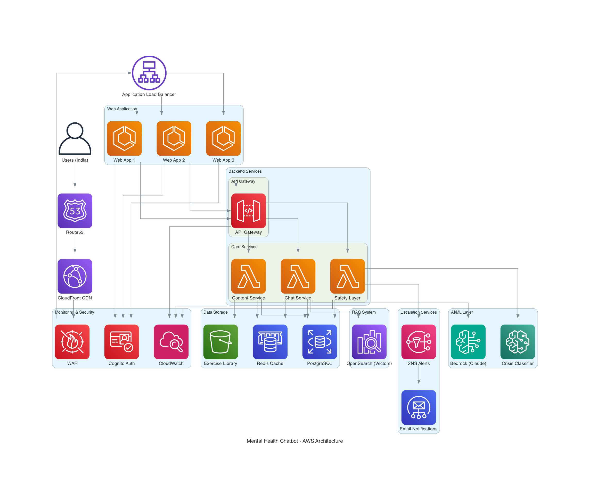

# Mental Health Support Chatbot

A between-session mental health support chatbot that provides evidence-based coping strategies, psychoeducation, and crisis detection with strict safety boundaries. Focused on the Indian market with bilingual (English + Hindi) support.

## What It Does

- **Coping Exercises** — CBT/ACT techniques like box breathing, grounding (5-4-3-2-1), thought records, and progressive muscle relaxation
- **Psychoeducation** — Evidence-based information on anxiety, depression, stress, panic, and sleep
- **Crisis Detection** — Tiered risk detection (Level 0-2) with automatic escalation and India-specific crisis resources
- **Bilingual Support** — English, Hindi, and Hinglish code-switching

## What It Does NOT Do

- Diagnose mental health conditions
- Provide medication advice
- Replace therapy or professional treatment
- Act as an emergency response system

## Crisis Resources (India)

- **KIRAN Mental Health Helpline:** 1800-599-0019 (24/7, toll-free)
- **Vandrevala Foundation:** +91 9999 666 555 (24/7)
- **iCall (TISS):** +91 9152987821 (Mon-Sat, 8 AM - 10 PM)
- **Emergency:** 112

## Architecture

## Docs

- [Requirements](requirements.md)
- [Design](design.md)

## Tech Stack

- **Frontend:** React 18, TypeScript, Tailwind CSS
- **Backend:** Node.js/Express or Python/FastAPI
- **Database:** PostgreSQL, Redis
- **Infrastructure:** AWS/GCP, CloudFlare

## License

This project is for educational and research purposes.
